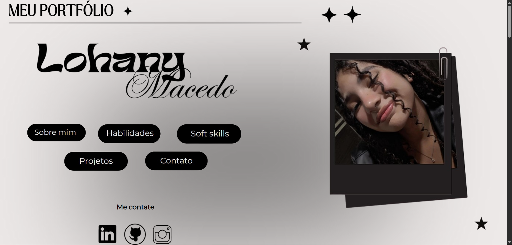
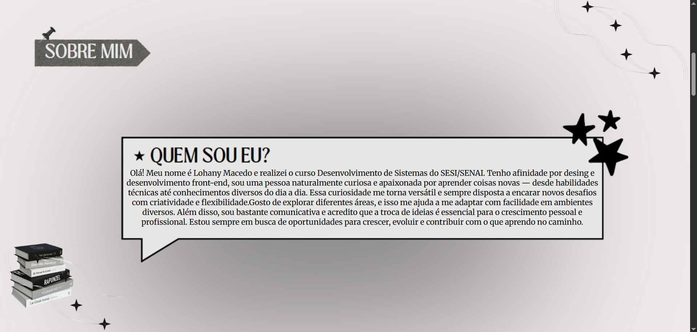
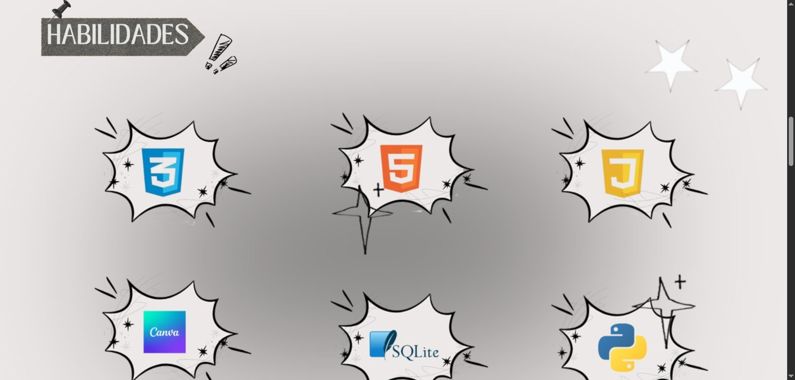
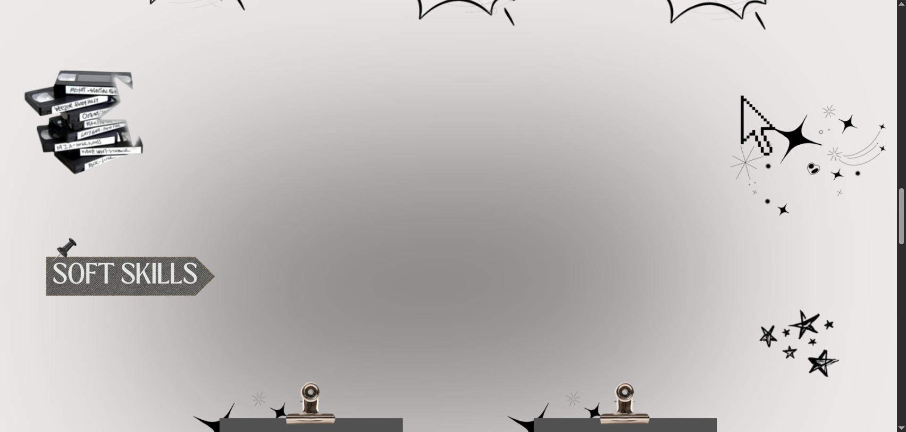
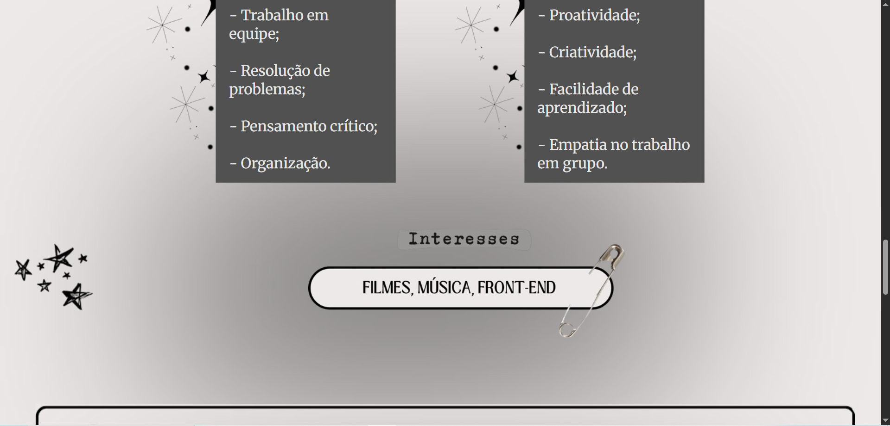
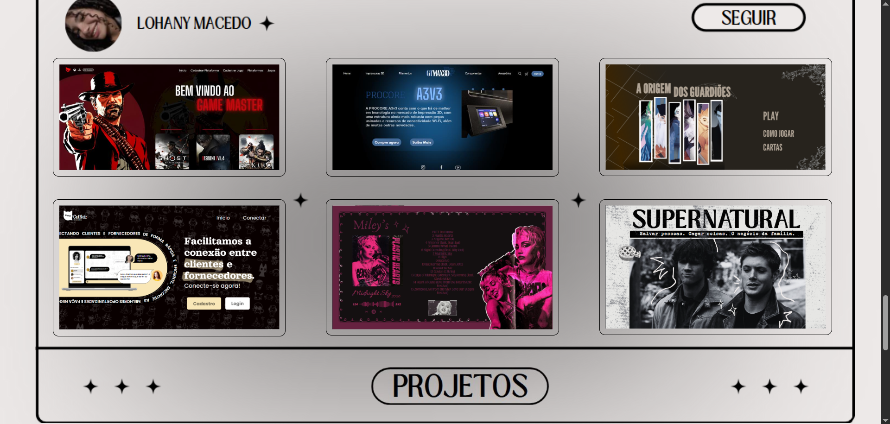
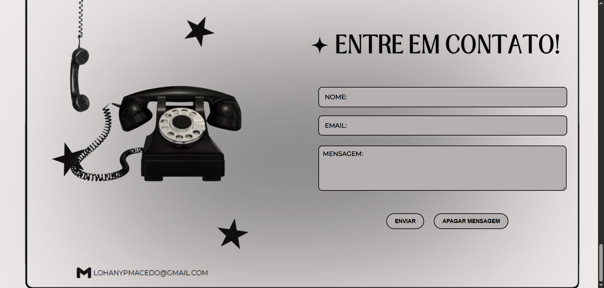

## Portfolio 2025 ✧˖ °

<i> O projeto do portfólio foi desenvolvido com HTML, CSS e JavaScript, com o objetivo de apresentar de forma clara e visualmente agradável informações sobre mim, incluindo minhas habilidades, projetos realizados e experiências pessoais.  
Pensado para oportunidades futuras, o site foi construído com foco na responsividade, garantindo uma navegação eficiente tanto em dispositivos móveis quanto em notebooks.<i>

## Desenvolvimento ── .✦

## Links ── .✦

[Protótipo](https://portfolio-tf9j.onrender.com/)  
[Site Renderizado](https://www.canva.com/design/DAGfFgELU5M/Ifd2Ytov07QJdoCWNWLPJA/edit)

###  ๋ ࣭ ⭑๋ ࣭ ⭑ ๋ ࣭ ⭑๋ ࣭ ⭑ ๋ ࣭ ⭑๋ ࣭ ⭑ ๋ ࣭ ⭑๋ ࣭ ⭑ ๋ ࣭ ⭑๋ ࣭ ⭑ ๋ ࣭ ⭑๋ ࣭ ⭑ ๋ ࣭ ⭑๋ ࣭ ⭑ ๋ ࣭ ⭑๋ ࣭ ⭑ ๋ ࣭ ⭑๋ ࣭ ⭑ ๋ ࣭ ⭑๋ ࣭ ⭑ ๋ ࣭ ⭑๋ 

